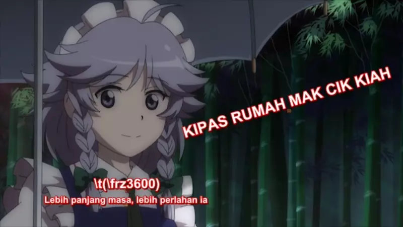

Berikut merupakan senarai bagi kesemua penanda yang disokong oleh format *Advanced Substation Alpha*.
Pendek kata, versi *ass-quickref.txt* tetapi lebih terperinci. Lihat tutorial pengenalan kepada atur huruf
yang menggunakan penanda asas.

Tanda pengatasan (*override tags*) sentiasa ikut bentuk yang sama:-
  Bermula dengan tanda miring cermin `\`, `nama` dan `parameter`.

Ada beberapa penanda yang rumit dan memerlukan lebih dari satu parameter,
dalam hal ini parameter akan diletakkan di dalam tanda kurung beserta koma di antaranya.

---

## Aksara Khas

Berikut adalah tanda yang ditulis di tengah teks, bukannya di dalam blok pengatasan. 
(cthnya. bukan di antara `{` dan `}`).

### Pemisah Baris Lembut (Soft Line Break)

`\n`

Memasukkan pemisah baris, tapi hanya bila dalam mod membalut 2. (Lihat di tanda [\\q][gaya-balutan]) 
Dalam mod membalut yang lain, ini diganti dengan jarak biasa.

### Pemisah Baris Kasar (Hard Line Break)

`\N`

Memasukkan pemisah baris, tanpa menghiraukan tetapan mod membalut.

> **Ingat, ini adalah N besar.**

### Jarak Kasar (Hard space)

`\h`

Memasukkan jarak kasar yang tidak akan pecah. Baris tidak akan pecah secara automatik
sebelum mahupun selepas jarak kasar dan jarak kasar tidak akan dilipat bila ia muncul di permulaan atau di akhir baris.

---

## Tanda Pengatasan (Override Tag)

Tanda pengatasan ini mestilah berada di dalam blok pengatasan, iaitu tanda yang dimulai dengan `{` dan diakhiri dengan `}`. 
Sebarang teks yang tidak dikenali akan dihiraukan, jadi ianya biasa digunakan untuk memberikan ulasan dalam baris. 
Tapi mencampur adukkan ulasan dengan tanda pengatasan ini amatlah tidak disarankan. 

Tanda-tanda ini terbahagi kepada dua kategori: 

* Kategori pertama: Menetapkan ciri bagi baris itu sendiri.
* Kategori keduanya: Hanya mengubah teks sesudahnya.

`\pos`, `\move`, `\clip`, `\iclip`, `\org`, `\fade` dan `\fad`
tergolong dalam jenis yang pertama, selebihnya tergolong dalam kategori yang kedua.

Tanda bagi kategori pertama selalunya muncul paling kurang sekali sahaja
dan di mana kedudukan tanda itu berada dalam baris tidak penting.

Di samping itu juga, ada di antaranya adalah khas yang boleh berubah-ubah. 
Contohnya:-

* `\pos` dan `\move`
* `\clip` dan `\iclip`
* `\fad` dan `\fade`

Hasil daripada mencampur berbilang tanda atau tanda khas ini akan berbeza-beza di antara pemapar dan tidak disarankan.

Tanda pada kategori yang kedua pula akan mengubah keseluruhan teks selepasnya sehinggalah ke akhir baris,
melainkan ia digantikan dengan tanda yang lain pada kemudiannya.

Tanda pengatasan akan selalu ikut bentuk yang sama: 
Dimulakan dengan tanda serong cermin `\`,
selepas itu `namanya` dan akhir sekali `parameter` bagi tanda itu. 
Jikalau parameter tidak ditulis/dikeluarkan, nilai lalai dari gaya baris itu akan digunakan.

Sesetengah tanda ada yang "rumit" dan memerlukan lebih dari satu parameter.
Dalam hal ini, parameter akan diletakkan di dalam tanda kurung beserta tanda koma diantara parameter itu.
 
 
**Nota pada penulisan:**

Segala apa yang ditulis di dalam `<` tanda kurung bersudut `>` pada halaman ini adalah parameter
yang mana pengguna perlu meletakkan nilai padanya. 
Tetapi tanda kurung bersudut bukanlah sebahagian daripada nilai yang pengguna patut sekalikan. 
Gunakanlah contoh-contoh yang diberikan sebagai rujukan cara meletakkan tanda yang sebetulnya. 
Secara umum, peraturan yang sama digunakan untuk semua tanda dalam penampilannya.

### Condong (Italic)

`\i1` `\i0`

Menjadikan teks itu condong yakni *italic*. 
Gunakan `\i1` untuk menghidupkannya dan `\i0` untuk mematikannya semula.

### Tebal (Bold)

`\b1` `\b0` `\b<kadar>`

Menjadikan teks itu tebal yakni ***bold***. 
Gunakan `\b1` untuk menghidupkannya dan `\b0` untuk mematikannya semula.

Yang `\b<kadar>` ni pula, guna bila mahu tetapkan kadar ketebalan sesuatu pasuan (fon) itu.
Perlu diingatkan, kebanyakan pasuan hanya menyokong satu hingga ke dua kadar sahaja.
Kadarnya pula adalah gandaan 100, seperti 100 paling "nipis", 400 "biasa", 700 "tebal" dan 900 adalah yang paling tebal.

> `Saya {\b1}memang{\b0} minat anime.`
>
> Perkataan "memang" akan ditebalkan.

> `Wau, teks {\b1}tebal la, sugoi na~`
>
> Teks akan tebal bermula dari 'tebal' sehingga akhir ayat.

> `{\b100}Berapa {\b300}tebal {\b500}kau {\b700}nak {\b900}hah?`
>
> Ketebalan perkataan akan meningkat.

**Ingat bahawa tidak semua pasuan menyokong kesemua kadar ketebalan.**

### Garis Bawah (Underline)

`\u1` `\u0`

Menjadikan teks itu bergaris bawah yakni <ins>underline</ins>. 
Gunakan `\u1` untuk menghidupkannya dan `\u0` untuk mematikannya semula.

### Potong (Strikeout)

`\s1` `\s0`

Menjadikan teks itu terpotong yakni ~~strikeout~~. 
Gunakan `\s1` untuk menghidupkannya dan `\s0` untuk mematikannya semula.

### Saiz Sempadan (Border size)

`\bord<saiz>`

Menukar kelebaran sempadan di sekeling teks. 
Tetapkan ia ke 0 (sifar) untuk mematikannya terus.

Jika "skala sempadan dan bayang" (lihat sifat skrip) dihidupkan,
nilainya akan mengikut piksel peleraian[^peleraian] skrip, jika tidak,
ia akan mengikut piksel peleraian video, 
(yang mana kelebaran sempadan akan berubah bergantung pada peleraian video sari kata dipaparkan).

> Nilainya tidak terbatas pada nombor bulat piksel, perpuluhan juga boleh.

> `\bord0`
>
> Matikan sempadan terus.

> `\bord3.7`
>
> Menetapkan sempadan selebar 3.7 piksel.

![Contoh Sempadan][aegi-bord]

### Saiz Sempadan [lanjutan]

`\xbord<saiz>` `\ybord<saiz>`

Guna tanda `\xbord` `\ybord` untuk menetapkan saiz sempadan arah X dan Y secara berasingan. 
Sebagai contohnya, ia berguna untuk membetulkan kelebaran sempadan untuk paparan sari kata yang kembang.

Ingat, jika guna `\bord` selepas `\xbord` atau `\ybord` di baris, ia akan menggantikan keduanya.

Pengguna boleh menetapkan nilai kelebaran bagi satu arah itu  ke 0 (sifar) untuk memadamkannya terus.

![Contoh Sempadan Arah X dan Y][aegi-xy-bord]

### Jarak Bayang (Shadow Distance)

`\shad<ukuran>`

Menetapkan jarak bayang dari teks. 
Tetapkan ke 0 (sifar) untuk memadamkannya terus. Sama seperti [\bord][sempadan].

**Tanda ini tak boleh negatif.**

![Contoh bayang][aegi-shad]

### Jarak Bayang [lanjutan]

`\xshad<ukuran>` `\yshad<jarak>`

Menetapkan jarak bayang teks dari arah X dan Y secara berasingan. 
Bayang hanya akan dimatikan jikalau nilai kedua-dua X dan Y adalah 0 (sifar).

Tanda ini boleh ditetapkan dengan nilai negatif
untuk meletakkan kedudukan bayang di atas atau kiri teks.

![Contoh bayang arah X dan Y][aegi-xy-shad]

### Redaman Tepi (Blur edges)

`\be0` `\be1` `\be<kadar>`

Memberikan kesan pelembut yang tidak ketara pada tepian teks. 
Kesan ini tidaklah jelas mana, tapi dalam beberapa keadaan, ia membuatkan teks nampak lebih bagus. 
Biasanya lebih jelas pada teks bersaiz kecil.

Penanda ini hanyalah meredamkan tepian, bukannya keseluruhan teks. 
Jadi kalau teks itu ada sempadan (yang telah ditetapkan oleh [\bord][sempadan]), sempadan akan diredamkan.

Pada versi lanjutan (Kernel gaussan), `<kadar>` adalah nilai untuk menerapkan kesan biasa. 
Perlu diingatkan bahawa nilai yang tinggi menjadikan ia kosong, tak ada apa-apa yang sudah tentu, tidak berguna. 
Untuk redaman yang kuat, `\blur` lebih berguna dan kadar kekuatannya mestilah nombor bulat.

![Contoh sempadan besera redaman tepi][aegi-bord-be]

### Redaman Tepi [Kernel Gaussan (Gaussian Kernel)]

`\blur<kadar>`

Tanda ini lebih kurang sahaja kegunaannya seperti tanda [\be][redaman],
tetapi ia menggunakan algoritma yang lebih maju,
yang mana ianya nampak lebih bagus pada kadar penuhnya.

Kadar kekuatannya boleh menggunakan nilai bukan nombor bulat, tidak seperti `\be`.

Kendatipun begitu, menetapkan kadar kekuatannya yang terlalu tinggi
akan memakan lebih banyak masa CPU untuk me-*render*-nya.

(*Sekarang rata-rata komputer & telefon pintar kini sudah mempunyai CPU yang cukup kuat
untuk kesan Redaman Tepi ini.*)

> Tanda ini hanya meredam tepian teks dan bukannya keseluruhan teks.
>
> Jadinya, kalau teks itu sudah mempunyai sempadan
> (yang telah ditetapkan oleh [\bord][sempadan]), sempadan akan diredamkan.

![Contoh redaman tepi][aegi-bord-blur]

### Nama pasuan (Font name)

`\fn<nama>`

Menetapkan jenis pasuan untuk teks yang ditentukan. 
Tanda `\fn` dan nama pasuan tak perlu dijarakkan, rapat-rapat jer. 
Pengguna juga tak patut letak tanda kurung .dsb pada nama pasuan.

> `\fnArial`
>
> Teks selepas tanda ini akan menggunakkan pasuan *Arial*.

> `{\fnArial}Teks ini akan guna Arial {\fnTimesNewRoman}dan ini pula TNR.`
>
> Dari 'Teks' sehingga 'Arial' akan guna *Arial*, manakala 'dan' sehingga 'TNR' pula akan guna *Times New Roman*.

![Contoh jenis2 pasuan][aegi-pasuan]

 Pasuan arab di dalam gambar ini telah diubah suai untuk sokongan aksara Jawi. 
 Lihat Repositori [PasuanJawi][pasuanjawi].

### Saiz Pasuan (Font Size)

`\fs<saiz>`

Digunakan untuk menetapkan saiz sesuatu pasuan. 
Saiz yang ditentukan adalah dalam saiz piksel skrip,
jadinya kalau satu baris pasuan itu bersaiz 40, maksudnya 40 piksel.

(*Nota teknikal: Ia sebenarnya dalam bentuk mata tipografi \[penerbitan komputer\] dan bukannya piksel skrip, tapi sebab pemaparan biasanya dalam 72dpi \[mengikut standard\], satu mata itu pun jadi sama dengan satu piksel peleraian skrip.*)

**Hanya nombor bulat sahaja dibenarkan.**

> `\fs10` 
Teks berikut akan bersaiz 10.

![Contoh saiz2 pasuan][aegi-pasuan-saiz]

### Skala Pasuan (Font Scale)

`\fscx<skala>` `\fscy<skala>`

Menyesuaikan saiz teks pada arah X (\fscx) ataupun Y (\fscy). 
Skala yang diberi dalam nilai peratusan, jadi kalau 100, maksudnya "saiz asal".

Ini bukanlah tetapan yang sama seperti saiz pasuan, kerana tetapan saiz tertakhluk
kepada pembayang pasuan semasa menskala teks mengubah rupa teks selepas pembayang. 
Jadi tanda ini seharusnya sentiasa digunakan dengan `\t` dan
bukannya `\fs` sebab menganimasikan pembayang pasuan yang berubah-ubah sangat jarang dibuat.

Tanda ini juga tertakhluk kepada lukisan vektor.

Pengguna boleh guna pengskala pasuan ini untuk membetulkan pemaparan anamorfik
dan juga untuk menetapkan saiz teks lebih tepat daripada `\fs`.

**Versi lama VSFilter akan membuang skala yang bukan nombor bulat.**

> `\fscx200`
>
> Menjadikan teks 50% lebar daripada biasa.

> `\fscy50`
>
> Menjadikan teks separuh tinggi.

> `\fscx200\fscy200`
>
> Menjadikan teks 2 kali ganda besar.

![Pengskalaan][aegi-xy-fsc]

### Penjarakan Huruf (Letter Spacing)

`\fsp<jarak>`

Digunakan untuk menukarkan jarak antara huruf di dalam teks. 
Gunakan ini untuk menyebarkan teks dengan lebih visual.

Nilai `jarak` adalah dalam nilai piksel peleraian dan boleh mempunyai nilai negatif dan perpuluhan.

![Tulisan Jarak dan Rapat][aegi-fsp]

### Putaran Teks (Text Rotation)

`\frx<nilai>` `\fry<nilai>` `\frz<nilai>` `\fr<nilai>`

Memutarkan teks pada paksi X, Y dan Z. Tanda `\fr` adalah singkatan untuk `\frz`.

* **Paksi X** adalah garis mengufuk pada skrin. Memutarkannya (dengan nilai positif) akan membuatkan bahagian atas teks menjauh dari skrin manakala bahagian bawah semakin dekat dengan skrin. (Macam membaring)

* **Paksi Y** adalah garis mencancang pada skrin. Memutarkannya (dengan nilai positif) akan membuatkan bahagian kanan teks menjauh dari skrin manakala bahagian kanan semakin mendekat dengan skrin.

* **Paksi Z** adalah garis serenjang pada skrin. Memutarkannya (dengan nilai positif) akan membuatkan teks berputar secara 2D melawan arah jam atau mengikut tawaf.

Nilai putaran yang diberi adalah dalam nilai darjah matematik,
contohnya 360 darjah untuk putaran penuh, walaupun hasilnya tidak nampak
seperti ianya berpusing, ianya berguna apabila kita mahu menganimasikannya,
contohnya pada tanda `\t(x,y)`.

Nilai negatif dan juga nilai melebihi 360 darjah dibolehkan.

Putaran baris berpusat pada titik pusatnya seperti yang dinyatakan pada [`\org`][titik-pusat].

Tanda ini juga berkesan pada [lukisan vektor][lukisan-vektor]

> `\frx45`
>
> Memutarkan teks 45 darjah pada paksi X

> `\fry-45`
>
> Memutarkan teks 45 darjah berlawanan pada paksi Y.

> `\frz180`
>
> Memutarkan teks 180 darjah pada paksi Z, menjadikan ia terbalik.

> `\frz-30` `\frz330`
>
> Kedua tanda di atas akan memberikan kesan yang sama
> kerana 330 darjah adalah 30 kurang daripada 360 darjah.

 ![Contoh-contoh putaran teks][aegi-frx-fry-frz]

> `\t(\frz3600)` 
>
> Meletakkan tanda animasi `\t` padanya akan membuatkan ia berputar
> bak umpama kipas rumah Mak Cik Kiah.

### Pericihan Teks (Text Shearing)

'\fax<faktor>' '\fay<faktor>'

Mericihkan teks (mengherot-benyotkan perspektif),
faktor 0 (sifar) bermaksud tiada apa.

Biasanya nilai faktor lebih kurang antara '-2' hingga '2',
lebih dari itu kebiasaannya tidak akan memberikan kesan yang diinginkan.

Pericihan dilakukan selepas putaran pada koordinat putaran. Sistem koordinat yang digunakan untuk mericih tidak terkesan dengan [titik pusat putaran][titik-pusat-putaran].

![Contoh pericihan][aegi-fax-fay]

### Pengekodan Teks (Text Encoding)

'\fe<id>'

Menetapkan pengekodan pasuan Windows untuk memilih pemetaan
yang pasuan gunakan bagi menterjemahkan titik kod Unikod kepada bentuk[^bentuk] yang terindeks di dalam pasuan.

Sesetengah pasuan tanpa pemetaan Unikod mungkin memerlukannya
untuk menjadikan teks berfungsi pada sesetengah bahasa.

*Jarang dah jumpa pasuan yang masih belum menggunakan Unikod,
biasanya jumpa pada pasuan yang uzur ibnu kuno.*

Kod ID yang biasa digunakan adalah:

* 0 - ANSI, Windows CP-1252 untuk bahasa Eropah Timur.
* 1 - Lalai, bergantung kepada tetapan sistem pengguna, tetapi membenarkan juga untuk fon subsistem memiilih pemetaan yang lain pada hal tertentu mengikut kesesuaian.
* 2 - Simbol, titik kod di antara 0 sehingga 255 diterjemahkan mengikut bentuk simbol yang pasuan telah tetapkan, contoh kegunaannya pada pasuan [Wingdings](https://en.wikipedia.org/wiki/Wingdings).
* 128 - Shift-JIS, bahasa Jepun.
* 129 and 130, tulisan Hangul dan Johab, untuk bahasa Korea.
* 134 - GB2312, untuk tulisan Cina Ringkas.
* 136 - BIG5, untuk tulisan Cina Tradisional.
* 162 - Turki.
* 163 - Vietnam.
* 177 - Ibrani.
* 178 - Arab.

Senarai yang lebih lengkap boleh didapati di [penyunting gaya][penyunting-gaya].

Pada fail ASS yang disimpan dalam pengekodan bukan unikod,
tanda ini juga akan memberikan kesan kepada muka kod teks sesudahnya untuk ditafsirkan.

Aegisub dan beberapa pemapar yang lain tidak menyokongnya.

Amatlah digalakkan untuk anda tidak bergantung kepadanya dan sentiasa menyimpan fail sari kata di dalam pengekodan Unikod. 
(Aegisub menyimpan fail di dalam Unikod UTF-8 secara lalai.)

### Warna (Colour)

`\c&H<bb><hh><mm>&` `\1c&H<bb><hh><mm>&` `\2c&H<bb><hh><mm>&` `\3c&H<bb><hh><mm>&` `\4c&H<bb><hh><mm>&`

Digunakan untuk menetapkan warna. 
`\c` adalah singkatan kepada `\1c`.

* `\1c`  untuk mengisi warna utama.
* `\2c`  untuk mengisi warna kedua. Hanya digunakan untuk karaoke.
* `\3c`  untuk warna sempadan.
* `\4c`  untuk warna bayang.

Kod warna yang diberi adalah dalam nombor perenambelasan(per-16-an)
atau lebih dikenali sebagai [heksadesimal](https://ms.wikipedia.org/wiki/Nombor_perenambelasan) dalam turutan Biru Hijau Merah.

Ingat bahawa turutannya terbalik dengan kod warna HTML.

*Kod warna mestilah dimulai dengan `&H` dan berakhir dengan `&`.*

Butang pemilih warna ![Pemilih Warna Aegisub][aegi-butang-pemilih-warna] boleh digunakan sebagai alat pembantu untuk memilih kod warna.

![Menu pemilih warna][aegi-pemilih-warna]

### Kelutsinaran (Alfa) [Transparency (Alpha)]

`\alpha&H<aa>` `\1a&H<aa>` `\2a&H<aa>` `\3a&H<aa>` `\4a&H<aa>`

Digunakan untuk menetapkan kelutsinaran teks.

* `\alpha`  menetapkan kelutsinaran semuanya sekaligus.
* `\1a`  menetapkan kelutsinaran warna pertama.
* `\2a`  menetapkan kelutsinaran warna kedua, yang mana hanya digunakan dalam karaoke.
* `\3a`  menetapkan kelutsinaran sempadan.
* `\4a`  menetapkan kelutsinaran bayang.

Kelutsinaran 00 (sifar) bermaksud legap/nampak sepenuhnya dan kelutsinaran FF (cthnya. 255 dalam perpuluhan) adalah lutsinar sepenuhnya.

> `\alpha&H80&`
>
> Menetapkan kelutsinaran pada semua berkaitannya kepada 80 per-16-an,
> 128 perpuluhan, menjadikan ianya 50% lutsinar secara umumnya.

> `\1a&HFF&`
>
> Menetapkan kelutsinaran warna isi kepada per-16-an FF, 255 perpuluhan,
> menjadikan ianya lutsinar dan meninggalkan sempadan dan bayang sahaja.

### Penjajaran Baris (Line Alignment)

 `\an<nilai>`

Digunakan untuk menetapkan kesejajaran baris. 
Penjajaran akan menetapkan kedudukan baris apabila tiada tanda pengatasan atau pergerakan ditetapkan,
jikalau tiada, ia akan menetapkan titik kedudukan dan putaran.

Tanda `\an` menggunakan nilai "pad nombor(numpad)" untuk kedudukannya. 
Ia serupa dengan kedudukan digit pada kekunci nombor (yang bahagian kanan sekali papan kekunci besar):

1. Bawah kiri
2. Bawah tengah
3. Bawah kanan
4. Kiri tengah
5. Tengah-tengah
6. Kanan tengah
7. Atas kiri
8. Atas tengah
9. Atas kanan

![Contoh Penjajaran Baris][aegi-penjajaran-baris]

### Penjajaran Baris (Lama/Usang)

 `\a<nilai>`

Digunakan untuk menetapkan kesejajaran baris menggunakan kod lama dari SubStation Alpha.
Tanda ini masih disokong tetapi sudah ketinggalan zaman, 
pengguna disarankan untuk menggunakan `\an` pada skrip yang terbaru,
kerana ianya lebih intuitif.

Pengecualiannya adalah `\a6` seharusnya digunakan untuk menterjemah tanda ala malas,
sebab kalau kamu nak bermalas-malasan,
sekurangnya bermalaslah dengan betul dan jimat sikit aksara.

Kedudukan dikira seperti yang berikut: 
Kalau nak teks bawah (sari kata),
1 untuk kiri, 2 untuk tengah dan 3 untuk kanan. 
Kalau nak teks atas pula, 4 atas kiri dan 8 untuk atas tengah:

1. Bawah kiri
2. Bawah tengah
3. Bawah kanan
4. Atas kiri
5. Atas tengah
6. Atas kanan
7. Kiri tengah
8. Tengah-tengah
9. Kanan tengah

### Kesan Karaoke (Karaoke Effect)

 `\k<tempoh>` `\K<tempoh>` `\kf<tempoh>` `\ko<tempoh>`

**Perlu diingatkan bahwa tanda ini hanya membuat kesan tertentu sahaja
dan kesan-kesan yang lain dibuat menggabungkan beberapa tanda yang lain.**

Kumpulan tanda `\k` menandakan sari kata untuk kesan karaoke dengan menentukan tempoh bagi setiap suku kata. 
Tanda `\k` diletakkan pada setiap belakang suku kata di dalam baris.

Tempoh yang diberi adalah di dalam sentisaat[^sentisaat], (cthnya. 100 sentisaat = 1 saat). 
Tanda `\k` secara umumnya tidaklah diisi satu per satu dengan tangan
tetapi dengan menggunakan peralatan pemasa karaoke seperti mod karaoke Aegisub.

Tanda `\k` yang berbeza memberikan kesan yang bermacam ragamnya:

* `\k`: Sebelum penyerlah, suku kata diwarnakan dengan warna kedua dan alfa.
Bila bermulanya suku kata, warna itu akan berubah
kepada warna utama dan alfanya.

* `K` dan `\kf`: Dua tanda ini serupa sahaja.
Suku kata diwarnakan dengan warna kedua, bila mula,
ia akan diwarnakan dengan warna kedua kepada utama dengan sapuan kiri ke kanan,
sapuan tamat bilamana masa suku kata pun tamat. 
Ingat ya, `\K` yang ini huruf besar dan amatlah berbeza padanya dari `\k` huruf kecil.

* `\ko`: Sama seperti \k, cumanya sebelum penyerlah, batasan/garis tepi suku kata dibuang
lalu muncul dengan serta merta bila suku kata bermula.

*Nota: Terdapat juga tanda karaoke lain,*`\kt`*, yang mana sangat berbeza dari yang lain.
Ianya amat jarang berguna dan Aegisub tidak menyokongnya, jadi tanda itu tidak
ditulis di sini.*

### Gaya Balutan (Wrap Style)

`\q`

Menentukan gaya pecahan baris diterapkan ke baris sari kata. 
Berikut adalah gaya yang tersedia:

* 0: Balutan pintar, menjadikan baris lebih kurang sama panjangnya
tetapi baris atas lebih panjang bilamana panjangnya mustahil untuk sama. Hanya boleh dipisah dengan `\N`.

* 1: Balutan sipi-sipi, selagi teks boleh diletak, selagi itu tidak akan dibalut. Hanya boleh dipisah dengan `\N`.

* 2: Tiada balutan, baris akan terus memanjang bahkan sehingga melebihi batas video dan pemisah. Boleh dipisah dengan `\n` dan `\N`.

* 3: Balutan pintar, sama seperti 0, tetapi baris di bawah lebih panjang.

### Penetap Semula Gaya (Style Reset)

`\r` `\r<namagaya>`

Digunakan untuk menetapkan semula gaya bagi baris kepada gaya lalai dan membatalkan segala gaya pengatasan yang ada termasuklah
[animasi][animasi] untuk teks yang berikutnya.

Tanda pertama yang tidak menetapkan sebarang gaya akan menetapkannya semula kepada gaya lalai projek,
manakala tanda kedua pula akan menetapkan semula gaya teks seterusnya dengan gaya yang ditetapkan.

> `-Oiii\N{\rBukanLalai}-Ha?\N{\r}-Kau siapa?` 
Anggaplah baris sekarang mempunyai gaya `Lalai`. Gaya `Lalai` diterapkan
bermula dari *Oiii*, kemudian ditukar kepada gaya `BukanLalai` untuk *-Ha?*,
selepas itu *-Kau siapa?* kembali semula kepada gaya `Lalai`.

### Kedudukan (Position)

`\pos(<X>,<Y>)`

Digunakan untuk menetapkan kedudukan bagi satu-satu baris. 
Koordinat X dan Y mestilah di dalam nombor bulat dan mengikut sistem koordinat peleraian skrip.

Titik X dan Y akan berubah sedikit mengikut kepada [penjajaran][penjajaran].

Kejajaran sari kata akan digunakan sebagai titik pusat kedudukan.

Cthnya baris dengan jajaran atas-kiri, bucu atas-kiri sari kata akan didudukkan ke koordinat mengikut `\pos`. 
Begitu juga dengan jajaran bawah-tengah, bawah tengah sari kata akan didudukkan ke koordinat yang dtetapkan.

![Contoh Kedudukan][aegi-pos]
Palang hijau menandakan kedudukan yang ditetapkan untuk baris. 
Kedudukan tetap sama, yang berbeza hanyalah titik pusatnya.

> **28/6/2022 DALAM PEMBIKINAN**

<!-- Nota kaki -->

[^bentuk]: // Bentuk = Glyph = Glif
[^sentisaat]: // 1 sentisaat bersamaan dengan 0.01 saat.
[^peleraian]: // Peleraian = Resolusi = Resolution

<!-- Pemboleh ubah pautan -->

[aegi-bord]: img/aegi-bord.png
[aegi-xy-bord]: img/aegi-xy-bord.png
[aegi-shad]: img/aegi-shad.png
[aegi-xy-shad]: img/aegi-xy-shad.png
[aegi-bord-be]: img/aegi-bord-be.png
[aegi-bord-blur]: img/aegi-bord-blur.png
[aegi-pasuan]: img/aegi-pasuan.png
[aegi-pasuan-saiz]: img/aegi-pasuan-saiz.png
[aegi-xy-fsc]: img/aegi-xy-fsc.png
[aegi-fsp]: img/aegi-fsp.png
[aegi-frx-fry-frz]: img/aegi-frx-fry-frz.png
[aegi-fax-fay]: img/aegi-fax-fay.png
[aegi-pemilih-warna]: img/aegi-pemilih-warna.png
[aegi-butang-pemilih-warna]: img/aegi-butang-pemilih-warna.png
[aegi-penjajaran-baris]: img/aegi-penjajaran-baris.png
[aegi-pos]: img/aegi-pos.png

[gaya-balutan]: #gaya-balutan-wrap-style
[sempadan]: #saiz-sempadan-border-size
[redaman]: #redaman-tepi-blur-edges
[titik-pusat]: #
[lukisan-vektor]: #
[penyunting-gaya]: #
[titik-pusat-putaran]: #
[animasi]: #
[penjajaran]: #penjajaran-baris-line-alignment

[pasuanjawi]: https://github.com/niskala5570/pasuanjawi

