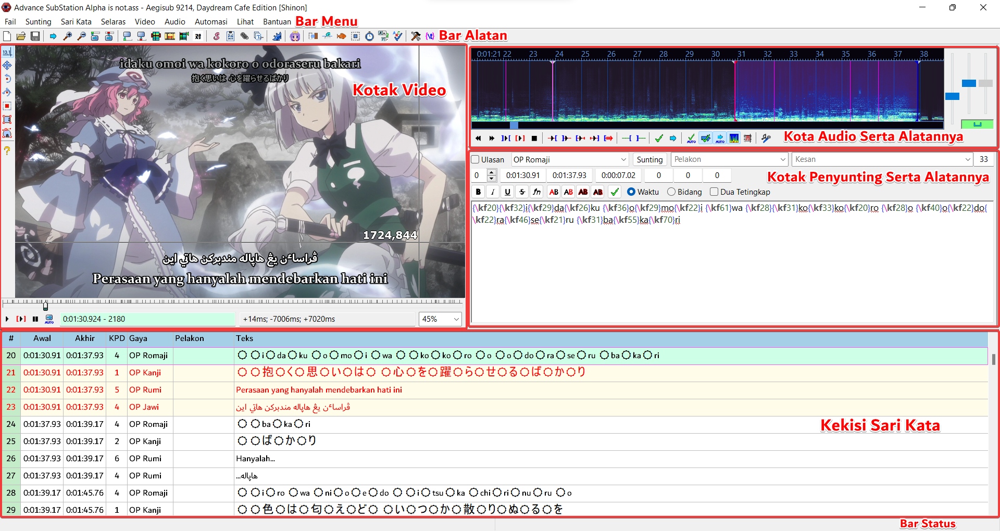
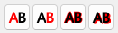
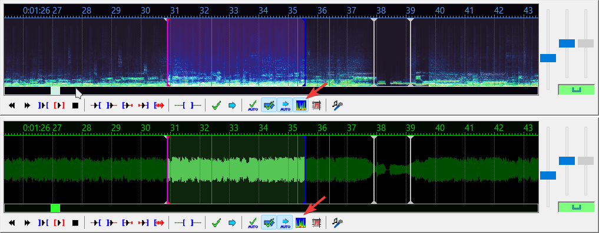

---

Rajah tangkapan layar diatas memaparkan tetingkap utama Aegisub secara keseluruhannya.

Kawasan penting yang paling kerap digunakan adalah **Kekisi Sari Kata** dan juga **Kotak Menyunting**.

---

### Kotak Kekisi (Subtitle Grid)

Kotak kekisi akan menunjukkan segala baris di dalam fail sari kata yang sedang disunting.
Baris akan ditanda dengan warna yang berbeza-beza bergantung kepada perihalan mereka.
 Klik pada baris untuk menyuntingnya.

* Berlatarkan Hijau Pudar = Sedang Dipilih
* Berlatarkan Biru Keunguan = Ulasan, ia tidak akan muncul di dalam video.
* Berlatarkan Kuning Pudar = Baris yang sedang dipaparkan di dalam video.
* Teks Bewarna Merah = Masa baris bertindih dengan baris lain (Muncul pada masa yang sama)

---

### Kotak Penyunting (Edit Box)

Kotak Penyunting bukanlah kotak yang biasa, tetapi kotak untuk menyunting teks-teks dan beberapa perihalan baris secara langsung.
Walaupun terdapat pilihan yang membolehkan pengguna untuk memasukkan masa mula dan tamat baris, amatlah jarang sekali ianya digunakan, kerana ianya lebih mudah untuk menyelaraskan masa dengan menggunakan **kotak audio** bahkan dengan masa dari video.
Gunakan alatan memformat untuk memasukkan kod memformat ke dalam baris semasa.

Empat butang  adalah untuk mengubah warna bagi setiap unsur baris.

Ubah teks sari kata dan tekan `Enter` untuk menerapkan segala perubahan yang dibuat dan secara automatiknya akan beransur ke baris seterusnya dan untuk kekal di baris yang sama, tekanlah kekunci `Ctrl` dan `Enter` serentak, perubahan akan tetap diterapkan.

---

### Kotak Audio (Audio Box)

Kotak yang gunanya untuk menyelaraskan masa baris mengikut audio dengan pantas dan tepat.
**Pemapar Audio** boleh memaparkan audio yang dimuatkan dalam dua gambaran, bentuk gelombang dan spektrum.

> Atas Spektrum, Bawah Gelombang

---

### Kotak Video (Video Box)

Kotak yang membolehkan pengguna untuk melihat rupa sari katanya pada video.
Juga membolehkan untuk penyelarasan masa mula/tamat bagi baris dengan memilih bidang (frame) video yang lebih terperinci dan
dengan menggunakan tetikus, ia boleh menentukan kedudukan, putaran dan memangkas baris sari kata (supaya sesuai mengikut pada keperluan satu-satu video).

---

### Bar Status (Status Bar)

Bar status ialah... Bar Status. (^^ゞ

Ia akan memaparkan mesej status kepada pengguna.

---

### Bar Menu dan Bar Alatan (Menu Bar and Tool Bar)

Untuk pengguna mencapai segala alatan aneka fungsi.
